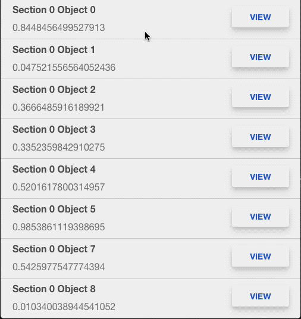
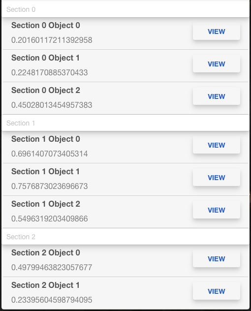
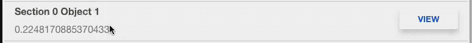
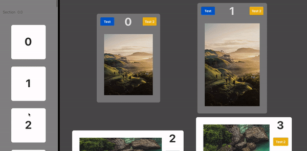

🛑 **Note: If you are planning to use this widget in Thingworx 8.5 or newer, strongly consider using [Core UI Widgets](https://github.com/ptc-iot-sharing/BMCoreUIWidgets) instead.**

This repository contains the standalone development version of the `BMCollectionView` widget and is the source from which the widget is merged into core ui widgets.​


# Collection Vie​w

<!-- TOC depthfrom:2 orderedlist:false -->

- [How it works](#how-it-works)
- [Usage](#usage)
    - [Binding Data](#binding-data)
    - [Configuring the mashup](#configuring-the-mashup)
- [Additional Features](#additional-features)
    - [Sections](#sections)
    - [Headers and Footers](#headers-and-footers)
    - [Insets](#insets)
    - [Flow Layout options](#flow-layout-options)
    - [Selection](#selection)
    - [Events](#events)
    - [Slide Menus](#slide-menus)
    - [Additional Style Properties](#additional-style-properties)
    - [Drag & Drop](#drag--drop)
    - [More Features](#more-features)
- [Download](#download)
- [Developing](#developing)
    - [Required software](#required-software)
    - [Proposed folder structure](#proposed-folder-structure)
    - [Developing](#developing)
    - [Building and publishing](#building-and-publishing)

<!-- /TOC -->

Collection View is a Thingworx widget that can display an arbitrary number of views in a scrolling container. The views can have arbitrary positions and sizes, defined by the type of layout selected. In practice, it handles most of the Repeater widget’s use cases, while offering improved performance and more functionality. Additionally, Collection View uses a lot of animations and almost any change in the data or layout will be animated.

 
- scrolling with Repeater (left) vs Collection View (right)

## How it works

Collection View will only create as many views as can be displayed on the screen and reuse them while scrolling. This way, scrolling performance is improved, as new views don’t need to be created while scrolling. Additionally, since only the visible views are created, the collection view can scale to hundreds and even millions of views with minimal impact on performance, even on mobile devices.

## Usage

The Collection View is used in a similar manner to the Repeater, with a couple of key differences. To make it easier to configure it, it includes a custom built configuration window containing detailed explanations of each setting.

### Binding Data

To bind data, simply bind the **Data** infotable property. In addition to the actual infotable, the Collection View also requires that entries in your infotable have a unique identifier that may be used to tell the entries apart. This is used by Collection View to understand how the data updates when it does so it can set up the animations accordingly. To set this unique identifier, select the appropriate field in the **UIDField** property.

### Configuring the mashup

Once data is bound, the next step is selecting the layout and configuring the mashup. The layout may use selected by setting the Layout property. By default there are five layout options, but custom layouts may also be created:
 * `Flow`: draws mashups in a grid-like layout
 * `Masonry`: draws mashups in a grid-like layout where each column may have a different scrolling speed.
 * `Tile`: draws mashup in a dashboard-like layout
 * `Stack`: draws mashups on top of each other

Each layout has its own different configuration options.

Then, once the layout has been chosen, the mashup may be selected by setting the **CellMashupName** property. Its size may be configured statically by setting the **CellHeight** and **CellWidth** properties. It may also be specified in the data set on a per-cell basis by setting the **CellHeightField** and **CellWidthField** properties.

To bind data from the infotable to each mashup, set the CellMashupPropertyBinding property. This property is a JSON object whose keys are the infotable fields and their values are strings representing the mashup parameters. For example, if your infotable has the name and value fields and your mashup has the ItemName and ItemValue parameters, this property’s value would look like this:
```js
{"name": "ItemName", "value": "ItemValue"}
```
The binding fields can be easily edited via the UI in the configuration window.


That's all that's required to get started with Collection View. However, there are a lot of other features that may be configured to further customize its behavior. The next section will detail a few of them. The availability of some of these features may depend on your layout selection.

## Additional Features

Beyond the basic mashup and layout configuration detailed above, Collection View supports some more features:

### Sections

Collection View allows you to group your data by a section field. To do this, set the **SectionField** to a data field that represents the section name of each item in the infotable. When the section field is set, =collection will group the items so that items from the same section always appear grouped together, even if they are in different positions in the source data set.

Further, choosing a section field allows you to use headers and footers to delimit each section and reinforce that grouping. Headers and footers are only available for the Table and Flow layouts.

### Headers and Footers
Headers and footers are configured similarly and you may configure either one, both or none of them. Only the header configuration will be detailed here - the footer is configured exactly the same.

To enable section headers, check the **ShowsHeaders** property. It is also required to select a mashup that represents the header by setting the **HeaderMashupName** property. Regardless of the selected layout, the headers will always stretch horizontally to fill the available area, however their height may be configured by setting the HeaderHeight property.

Additionally, the headers may be pinned, so that wherever the scroll position is, the current section's header is always visible at the top of collection view. To enable this for the table layout, check the **TableLayoutPinsHeadersToContentEdge** property. To enable this when using the flow layout, check the **FlowLayoutPinsHeadersToContentEdge** property.


- Collection View with headers


### Insets

When using the Table or Flow layout with a section field, the sections may have an inset defined for them. The insets determine the spacing between each sections and Collection View's edges. The insets may be configured by setting the SectionInsets property. This property is a comma separated list of numbers specifying in order the left, top, right and bottom inset.

### Flow Layout options

When using the Flow layout, there are a couple of extra layout configuration options:
**FlowLayoutGravity** controls how the cells are spaced from each other in each row. This property can take one of these four values:
 * `Edge`: the cells are positioned with equal spacing between them, with the first cell appearing on the left edge and the last cell appearing on the right edge.
 * `Spaced`: the cells are positioned with equal spacing between themselves and the Collection View's edges.
 * `Center`: the cells are positioned next to each other, with equal spacing between leftmost cell and the left edge and the rightmost cell and the right edge.
 * `Expand`: the cells are positioned next to each other, expanding in width to fill the available row area.

**FlowLayoutRowSpacing** controls the vertical spacing between each row.
**FlowLayoutTopPadding** controls the vertical spacing between the Collection View's top edge and its content.
**FlowLayoutBottomPadding** controls the vertical spacing between the Collection View's bottom edge and its content.
**FlowLayoutLeftAlignFinalRow** may be enabled to cause the last row in each section to have its cells aligned towards the left, so they appear directly below the cells in all other rows, rather than have them centered using the selected gravity as default.

### Selection

Collection View supports displaying and controlling selection, like other infotable widgets. To enable selecting and deselecting items using the Collection View, check the **CanSelectCells** property. When this property is enabled, clicking on a cell will select it and clicking it while selected will deselect it. The CanSelectMultipleCells property may be enabled to allow Collection View to select more than one cell. If that property is not enabled, clicking on a second cell will cause the currently selected to be deselected before the second cell is selected.

The selection may also be controlled by invoking the **Deselect** or **SelectAll** widget services. Additionally, the *Collection View Selection Controller* widget may be added to the cell mashup. It can be used to control the mashup's selection.

Whenever any cell is selected, the bindable **HasSelectedCells** property will be set to true. Additionally, if other widgets are bound to the same data set as Collection View, the **ScrollsToSelectedCell** property may be enabled to cause Collection View to scroll to the selected cell whenever any other widget modifies the selection. For example, when using Google Maps to select a pin, Collection View will automatically scroll to the item representing the clicked pin.

Finally, the selection status is also available to the cell mashups themselves so it may be used to control the contents in those mashups. To use it, set the **CellMashupSelectedField** to the name of the mashup parameter that will receive the selection status for that mashup. That parameter will be set to true if the cell is selected or false otherwise.

### Events

Collection View supports responding to a number of events occurring on the cells:
 * `CellWasClicked` triggered whenever any cell is clicked or tapped.
 * `CellWasLongClicked` triggered whenever any cell is long clicked or long tapped.
 * `CellWasDoubleClicked` triggered whenever any cell is double clicked or double tapped. On mobile devices, binding this event will disable the native double tap to zoom behavior on cells.
 * `CellWasRightClicked` triggered whenever any cell is right clicked. This event is only available on desktop browsers.

Unlike most other widgets, these events may occur independent of the current selection and will work even if selection is not enabled. To retrieve the event item's properties, Collection View creates a number of event attributes, based on the data set's fields. For example, if Data is bound to an infotable with the name and value fields, Collection View will generate the Event:name and Event:value properties. Whenever any event occurs, those two properties' values will be set to the event item's properties and may be different from the selected row's properties.

### Slide Menus

Collection View supports defining a customizable action menu. The slide menu is initially hidden, but can be made temporarily visible in three ways:
On desktop browsers, right clicking on a cell will cause its menu to expand.
On mobile browsers, the menu may be shown by sliding the cell towards the left.
On either, it is possible to include a *Collection View Menu Controller* widget in the cell mashup and use its services to control the menu's display.

When the menu is visible, selecting any of its options or performing any sort of action like scrolling or clicking on any other cell will cause the menu to collapse again.

To enable the slide menu, set the **CellSlideMenu** to a state definition. The entries in that state definition will become the actionable items in the menu. The menu will use the background color, text color and image in the state definition's styles to style each menu entry. The menu may be further customized by setting the **CellSlideMenuIconSize**, **CellSlideMenuIconGravity** and **CellSlideMenuOrientation** properties.

Whenever a slide menu is selected, Collection View will generate an event property for each state in that menu. For example, if the menu is set to state definition with the Delete and Modify states, Collection View will gain the Menu:Delete and Menu:Modify events. These events will be triggered whenever the relevant menu option is selected for any cell. Additionally, just like with the previous click events, the Event:… properties will be set to the triggering cell item's values.


- a slide menu

### Additional Style Properties

The cells in the collection view may be further customized using any of the following style properties:
 * CellStyleSelected is a style whose background color will be applied to the selected cells. Note that the cell mashup's background must be transparent for this to have any effect.
 * CellStyleHover is a style whose background color will be applied to the currently hovered cell. Note that the cell mashup's background must be transparent for this to have any effect.
 * CellStyleActive is a style whose background color will be applied to the currently clicked cell. Note that the cell mashup's background must be transparent for this to have any effect.
 * CellBorderRadius the CSS border radius to use for each cell. Using this property will also cause the cell to have its overflow CSS property set to hidden.
 * CellBoxShadow the CSS box shadow to use for each cell. Using this property will also cause the cell to have its overflow CSS property set to hidden.
 * UsesRipple may be enabled to cause the cells to have a ripple effect when clicked. The ripple will originate at the clicked point and gradually expand to fill the entire cell. When this property is enabled, the RippleStyle should be set to a style whose background color will be used as the ripple's color. Using this property will also cause the cell to have its overflow CSS property set to hidden.


### Drag & Drop

Collection View supports drag and drop as a way for end-users to manipulate data in an easy, familiar way. Drag and drop can be used with collection view to perform the following manipulations:
 * Reordering items within collection view
 * Removing items from collection view
 * Moving or copying items from one collection view to another

To enable drag & drop, check the **CanDragCells** property. Note that this property is also bindable, allowing the developer to control when this feature should be enabled or not. The types of behaviours that should be enabled by drag and drop are then configured using a series of other checkbox properties:
 * CanMoveCells controls whether cells can be reordered via drag and drop
 * CanMoveCellsAcrossSections controls whether cells can be moved into different sections via drag and drop
 * CanRemoveCells controls whether calls can be deleted by moving them outside of collection view
 * CanTransferCells controls whether cells may be moved onto another collection view

In order to transfer or copy cells into another collection view, the second collection view must be configured to accept items. This is done by enabling the **CanAcceptCells** property. The requirement for a transfer to occur is that the two collection views must have compatible data shapes. The receiving collection view must have a data shape that is either identical or a subset of the transferring collection view.



 - Drag and drop

### More Features

By using scripting, the Collection View may be even further customized. Through scripting it is possible to achieve many advanced behaviors such as:
 * Customizing the size of each cell based on its contents.
 * Customizing the cell's contents based on its data object.
 * Creating and using custom layout objects, so that items may be arranged differently even based on their contents.
 * Customizing the animations and their attributes such as timing and easing.
 * Enabling or disabling selection on a per-cell basis.
 * Customizing the rules for transferring and accepting cells.
And more…

It is also possible to use the Collection View framework as the basis for a different, more specialized widget, however most of the scripting features are more difficult to implement and use and will be detailed in a separate post.

## Download

To download Collection View, go to the releases tab at the top of the page. Note that Collection View also requires the CoreUI widget in order to function.

## Developing

### Required software

The following software is required:

* [NodeJS](https://nodejs.org/en/) needs to be installed and added to the `PATH`. You should use the LTS version.

The following software is recommended:

* [Visual Studio Code](https://code.visualstudio.com/): An integrated developer enviroment with great typescript support. You can also use any IDE of your liking, it just that most of the testing was done using VSCode.

### Proposed folder structure

```
demoWebpackTypescriptWidget
│   README.md         // this file
│   package.json      // here you specify project name, homepage and dependencies. This is the only file you should edit to start a new project
│   tsconfig.json     // configuration for the typescript compiler
│   webpack.config.js // configuration for webpack
│   metadata.xml      // thingworx metadata file for this widget. This is automatically generated based on your package.json
│   index.html        // when testing the widget outside of thingworx, the index file used.
└───src               // main folder where your developement will take place
│   │   index.ts               // source file used when testing the widget outside of twx
│   │   demoWebpack.ide.ts     // source file for the Composer section of the widget
│   │   demoWebpack.runtime.ts // source file for the Runtime section of the widget
│   └───internalLogic          // usually, put the enternal logic into a separate namespace
│   │   │   file1.ts           // typescript file with internal logic
│   │   │   file2.js           // javascript file in ES2015 with module
│   │   │   ...
│   └───styles        // folder for css styles that you can import into your app using require statements
│   └───images        // folder for image resources you are statically including using require statements
│   └───static        // folder for resources that are copied over to the development extension. Think of folder of images that you referece only dynamicaly
└───build         // temporary folder used during compilation
└───zip               // location of the built extension
```

### Developing

In order to start developing you need to do the following:

1. Clone this repository
    ```
    git clone https://github.com/ptc-iot-sharing/BMCollectionView.git
    ```
2. Run `npm install`. This will install the development dependencies for this project.
3. Start working on your widget.

### Building and publishing

The following commands allow you to build and compile your widget:

* `npm run build`: builds the production version of the widget. Creates a new extension zip file under the `zip` folder. The production version is optimized for sharing and using in production enviroments.
* `npm run upload`: creates a build, and uploads the extension zip to the thingworx server configured in `package.json`. The build is created for developement, with source-maps enabled.
* `npm run watch`: watches the source files, and whenever they change, do a build.